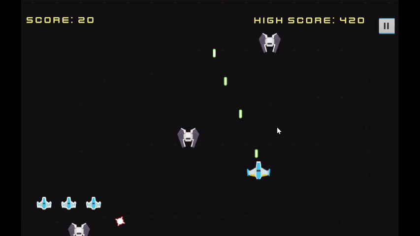
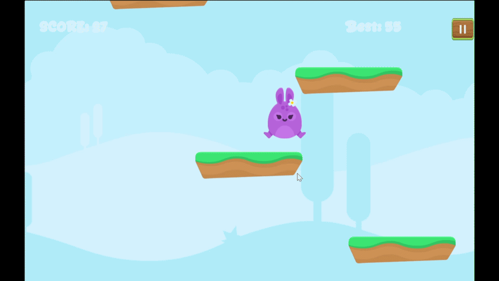

# Hello there 👋, I'm Natnat
### Game Developer | Programmer | Game Designer

## 👩🏻‍💻 About Me

- 🎮 I'm interested in game development
- 💻 Currently learning Unity, Godot, and Blender
- 🎨 I also enjoy UI/UX and design
- 📚 Computer Science student
- 🎓 BINUS University

<!--  -->

## 🎮 Unity Projects

<table>
  <tr>
    <th>The Coulus</th>
    <th>Lompat Anjay</th>
  </tr>

  <tr>
    <td align="center">
      
    </td>
    <td align="center">
      
    </td>
  </tr>

  <tr>
    <td align="center">
      A 2D pixel-art endless shooter built with Unity and C#, featuring wave-based combat, resource management, and challenging boss encounters.
    </td>
    <td align="center">
      A 2D vertical platformer inspired by classic endless-jumping games, featuring character selection and progressively challenging platform navigation.
    </td>
  </tr>

  <tr>
    <td align="center">
      
      
    </td>
    <td align="center">
      
      
    </td>
  </tr>
</table>

## 🎮 Godot Projects

<table>
  <tr>
    <th>Crappybara</th>
    <th>Soon</th>
  </tr>

  <tr>
    <td align="center">
      
    </td>
    <td align="center">
      
    </td>
  </tr>

  <tr>
    <td align="center">
      A 2D virtual pet and idle collector game built in Godot, starring a capybara you can grow,
      battle with, and dress up. Features a gacha skin system with rarity tiers and a battle mode
      for grinding gold and XP.
    </td>
    <td align="center">
      Description
    </td>
  </tr>

  <tr>
    <td align="center">
      
      
    </td>
    <td align="center">
      
      
    </td>
  </tr>
</table>

## 🛠️ Skills

- Unity
- Godot
- Blender
- Figma
